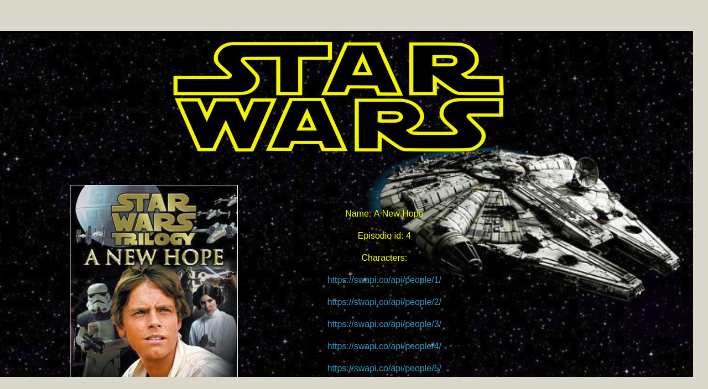

Titulo: apiStarW

Descripción del proyecto:Proyecto de consumo de la API de Star Wars.Se realiza un consumo de la API a tráves del método AJAX, y cuándo se obtiene la respuesta se itera sobre el JSON para pintar datos en el index a tráves del DOM.

Tecnologías utilizadas: HTML, CSS, Grilla.

Para que empresa fué desarrollado: Laboratoria.

Tecnologías utilizadas: AJAX, Jquery,ECMA6, Javascript, API,CSS, HTML, Framework Foundation.

Este ejercicio consiste en el consumo de un API (en este caso se trata de la API de Star Wars), se hizo el consumo de esta a tráves de un llamado AJAX,se obtuvo un JSON como respuesta el cuál se iteró el Array de objetos con diversas funciones para poder obtener datos muy precisos como los nombres de los filmes y los personajes que participan en cada una de ellas. Estos datos se pintan en pantalla con la técnica template string de ECMA6.

En este ejercicio los datos del personaje se pintan de manera dinámica a tráves de ajax y la imagen se jala de un json local.
Cabe mencionar que por cuestiones de practicidad solo se encuentran en el json de imagenes los primeros 9 personajes de la primera película.

